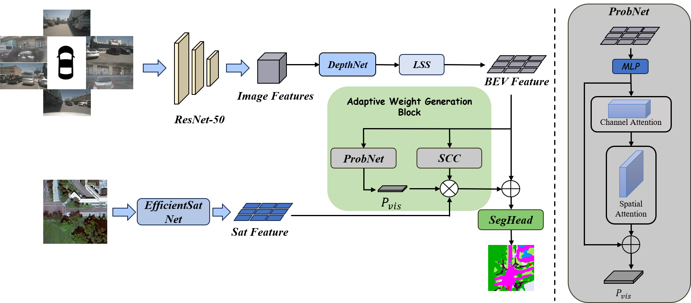
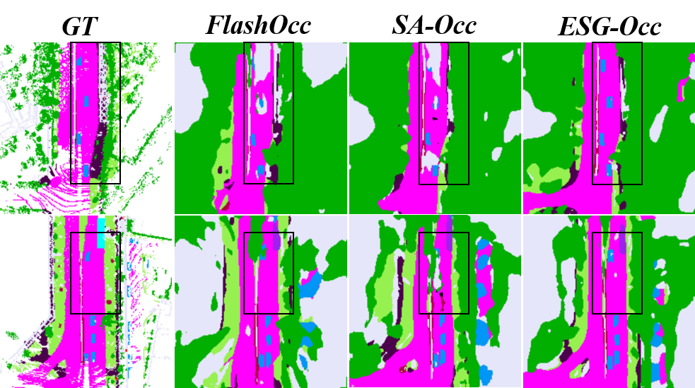

# ESG-Occ: Efficiency-First Satellite-Ground Fusion for 3D Occupancy Prediction

[](link-to-your-paper)
[](LICENSE)
[](https://github.com/yourname/ESG-Occ)

Official PyTorch implementation of **"ESG-Occ: Efficiency-First Satellite-Ground Fusion for 3D Occupancy Prediction"**.  

<div align="center">
  
  <p><i>Overall framework of ESG-Occ. Our EfficientSatNet extracts lightweight overhead features, while the Adaptive Weight Generation Block (AWGB) fuses them with street-view BEV features in a scene- and visibility-aware manner.</i></p>
</div>

---

## 🌟 Highlights

- **Lightweight Satellite Branch**: Introduce **EfficientSatNet**, a MobileNetV3-based feature pyramid, reducing FLOPs while preserving overhead context.
- **Adaptive Fusion**: Propose **AWGB** that dynamically balances street-view vs. satellite contributions using:
  - ProbNet (visibility-aware weighting)  
  - Complexity-aware modulation  
- **Real-Time Ready**: Achieves **64.23 ms/frame** on RTX 4090. Experiments on the Occ3D-nuScenes benchmark show that ESG-Occ delivers competitive accuracy with significant efficiency gains, lowering computational overhead by 15.6%.
- **Open & Reproducible**: Code, configs, and pretrained models are publicly released.

---

## 📊 Performance on Occ3D-nuScenes

| Method        | FLOPs (G) | Latency (ms) | mIoU (%) |
|---------------|-----------|--------------|----------|
| FlashOcc      | 248.57    | 60.70        | 32.08    |
| SA-Occ        | 442.19    | 65.88        | 39.03   |
| **ESG-Occ**   | **373.06**| **64.23**    | **39.38**|

*Measured on NVIDIA RTX 4090.*

---

## 🚀 Installation

We will release the code soon

```bash
# clone repo
git clone https://github.com/yourname/ESG-Occ.git
cd ESG-Occ

# create environment
conda create -n esgocc python=3.9 -y
conda activate esgocc

# install dependencies
pip install -r requirements.txt
````

---

## 📂 Dataset Preparation

We follow [SA-Occ](https://github.com/chenchen235/SA-Occ) for data preparation.

1. Download **nuScenes** dataset and corresponding **Occ3D annotations**.
2. Organize files as:

```
datasets/
  nuscenes/
    samples/
    sweeps/
    maps/
    occ3d_annotations/
```

3. Update dataset paths in `configs/dataset.yaml`.

---

---

## 📸 Visualization

<div align="center">
  
  <p><i>Qualitative comparison of ESG-Occ vs. baselines. Visual comparison with baselines indicates that ESG-Occ produces more distinct boundary delineation and sustains robustness in heavily occluded regions.</i></p>
</div>

---

## 🛠 Project Structure

```
ESG-Occ/
├── configs/           # YAML configs for model/dataset
├── datasets/          # Dataset loading & preprocessing
├── models/            # EfficientSatNet, AWGB, fusion heads
├── tools/             # train/test/demo scripts
├── assets/            # figures for README
├── checkpoints/       # pretrained weights
└── requirements.txt
```

---

## 📖 Citation

If you find this work useful, please cite our paper:

```bibtex
@inproceedings{huangxianpeng2025esgocc,
  title     = {ESG-Occ: Efficient Satellite–Ground Fusion for Real-Time 3D Occupancy Prediction},
  author    = {Huang, Xianpeng and Li,Jian},
  booktitle = {ICICML},
  year      = {2025}
}
```

---

## 📬 Contact

For questions or issues, feel free to open an [issue](https://github.com/PIONEER233/ESG-Occ/issues) or contact **[huangxianpeng24@nudt.edu.cn](mailto:huangxianpeng24@nudt.edu.cn)**.

---

## 📜 License

This project is released under the [MIT License](LICENSE).
